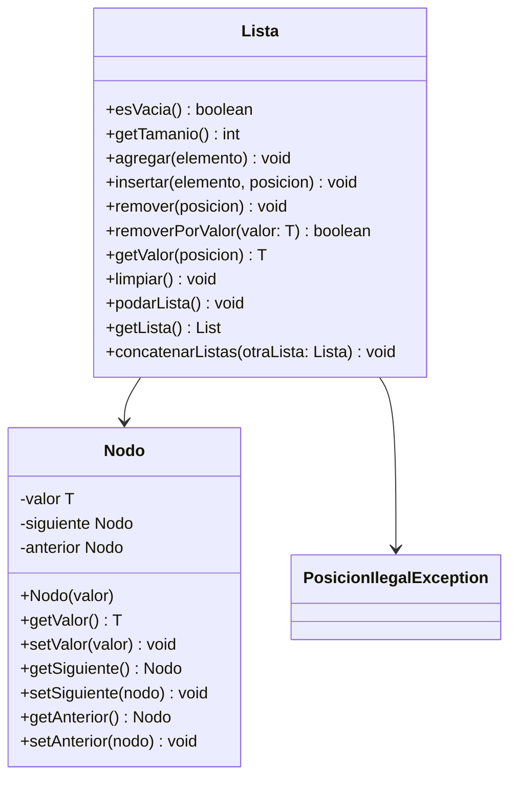

# Proyecto - Estructuras Dináminas Lineales
## Propósito del Proyecto

El propósito de este proyecto es implementar y comprender el funcionamiento de diversas estructuras de datos dinámicas lineales, tales como listas, pilas y colas. Estas estructuras son fundamentales en la informática y se utilizan en una amplia variedad de aplicaciones, desde la gestión de memoria hasta la implementación de algoritmos complejos.

### Objetivos Principales

- Implementar estructuras de datos dinámicas lineales utilizando clases en Java.
- Comprender y aplicar los principios de encapsulamiento, herencia y polimorfismo.
- Desarrollar métodos para manipular estas estructuras, incluyendo operaciones de inserción, eliminación y búsqueda.
- Realizar pruebas unitarias para asegurar el correcto funcionamiento de las estructuras de datos implementadas.

### Estructuras de Datos Implementadas

- **Lista**: Una colección ordenada de elementos que permite la inserción y eliminación en cualquier posición.
- **Pila**: Una estructura de datos que sigue el principio LIFO (Last In, First Out), donde el último elemento insertado es el primero en ser eliminado.
- **Cola**: Una estructura de datos que sigue el principio FIFO (First In, First Out), donde el primer elemento insertado es el primero en ser eliminado.

Este proyecto servirá como una base sólida para el estudio y la aplicación de estructuras de datos dinámicas en problemas del mundo real.


## Diagrama de clases de una Lista Doblemente Ligada
[Editor en línea](https://mermaid.live/)


[Referencia-Mermaid](https://mermaid.js.org/syntax/classDiagram.html)

## Diagrama de clases UML con draw.io
El repositorio está configurado para crear Diagramas de clases UML con ```draw.io```. Para usarlo simplemente agrega un archivo con extensión ```.drawio.png```, das doble clic sobre el mismo y se activará el editor ```draw.io``` incrustado en ```VSCode``` para edición. Asegúrate de agregar las formas UML en el menú de formas del lado izquierdo (opción ```+Más formas```).

## Uso del proyecto con make

### Default - Compilar+Probar+Ejecutar
```
make
```
### Compilar
```
make compile
```
### Probar todo
```
make test
```
### Ejecutar App
```
make run
```
### Limpiar binarios
```
make clean
```
## Comandos Git-Cambios y envío a Autograding

### Por cada cambio importante que haga, actualice su historia usando los comandos:
```
git add .
git commit -m "Descripción del cambio"
```
### Envíe sus actualizaciones a GitHub para Autograding con el comando:
```
git push origin main
```
## Comandos individuales
### Compilar

```
find ./ -type f -name "*.java" > compfiles.txt
javac -d build -cp lib/junit-platform-console-standalone-1.5.2.jar @compfiles.txt
```
Ejecutar ambos comandos en 1 sólo paso:

```
find ./ -type f -name "*.java" > compfiles.txt ; javac -d build -cp lib/junit-platform-console-standalone-1.5.2.jar @compfiles.txt
```


### Ejecutar Todas la pruebas locales de 1 Test Case

```
java -jar lib/junit-platform-console-standalone-1.5.2.jar -class-path build --select-class miTest.AppTest
```
### Ejecutar 1 prueba local de 1 Test Case

```
java -jar lib/junit-platform-console-standalone-1.5.2.jar -class-path build --select-method miTest.AppTest#appHasAGreeting
```
### Ejecutar App
```
java -cp build miPrincipal.Principal
```
Los comandos anteriores están considerados para un ambiente Linux. [Referencia.](https://www.baeldung.com/junit-run-from-command-line)
